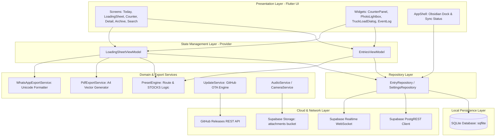
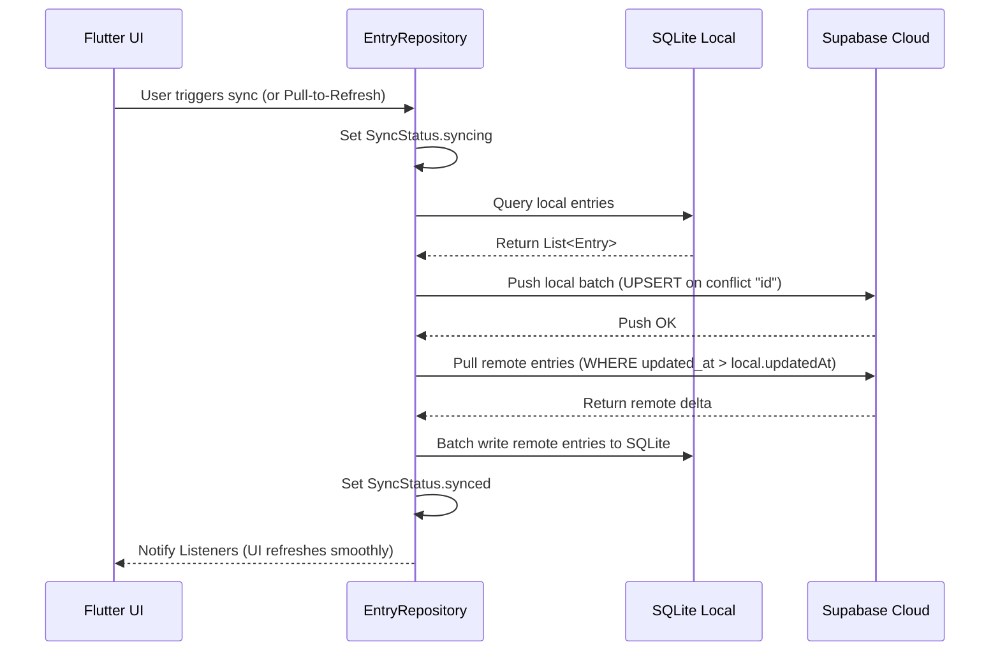
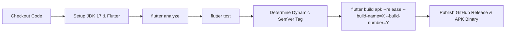

# Dispatch Diary — Comprehensive Low-Level System Manual & Technical Architecture

> **Version**: 2.0.x (Native Flutter Engine)  
> **Platform**: Android (Native APK) / Desktop / Web  
> **Target Audience**: Engineers, Architects, System Administrators, and Warehouse Operations Leads  
> **Repository**: `t-mpanza/dispatch-logbook`

---

## Table of Contents
1. [Executive Overview & Operational Purpose](#1-executive-overview--operational-purpose)
2. [High-Level Architectural Blueprint](#2-high-level-architectural-blueprint)
3. [Layer 1: Core Data Models & Serialization](#3-layer-1-core-data-models--serialization)
4. [Layer 2: Local Persistence Engine (SQLite / Offline-First)](#4-layer-2-local-persistence-engine-sqlite--offline-first)
5. [Layer 3: Cloud Synchronization & Realtime Engine](#5-layer-3-cloud-synchronization--realtime-engine)
6. [Layer 4: Business Logic, Rule Engines & Export Services](#6-layer-4-business-logic-rule-engines--export-services)
7. [Layer 5: State Management & Reactive ViewModels](#7-layer-5-state-management--reactive-viewmodels)
8. [Layer 6: UI Design System, Widgets & Presentation Flow](#8-layer-6-ui-design-system-widgets--presentation-flow)
9. [Layer 7: Android Platform, Release Keystore & CI/CD Pipeline](#9-layer-7-android-platform-release-keystore--cicd-pipeline)
10. [End-to-End Operational Lifecycle & Failure Modes](#10-end-to-end-operational-lifecycle--failure-modes)

---

## 1. Executive Overview & Operational Purpose

### 1.1 What is Dispatch Diary?
**Dispatch Diary** is an industrial-grade, mission-critical logistics tracking and loading-sheet management system built specifically for tyre warehouse dispatch bays and freight distribution operations. 

In fast-paced freight hubs, loading operations involve hundreds to thousands of heavy commercial tyres loaded onto multiple transport trucks per shift (e.g., regional branch runs like **DBN**, **NLS**, **BLOEM**, **PLK**, internal **STOCKS** shunts, and direct customer drops like **NLH** or **TIREPOINT**).

### 1.2 The Problem It Solves
Traditional warehouse environments suffer from severe operational friction:
1. **Unreliable Paper & Spreadsheet Logs**: Physical clipboards get damaged, lost, or misplaced during frantic loading operations.
2. **Offline Environments & Dead Zones**: Heavy steel-framed warehouse bays often lack consistent Wi-Fi or cellular reception, causing standard cloud web apps to freeze, drop data, or fail completely.
3. **Data Loss During Multi-Device Shifts**: Multiple dispatchers and shift leads working simultaneously need seamless state convergence without race conditions or overwrite bugs.
4. **Compliance & Audit Verification**: Operations demand proof-of-dispatch: physical slip photos, driver signatures, exact departure timestamps, voice notes for damage claims, and immediate WhatsApp / PDF reports for fleet managers.

### 1.3 Core Engineering Philosophy
Dispatch Diary is architected on five foundational tenets:
- **Zero-Latency Offline-First**: Every single user action writes immediately to a local ACID-compliant SQLite embedded database before any network call is attempted.
- **Bi-Directional Conflict-Free Sync**: Background sync merges changes between local SQLite and remote PostgreSQL (Supabase) using deterministic timestamp resolution (`updated_at`).
- **Tactile Haptic Feedback**: Critical industrial actions (counting tyres, starting trips, deleting records) provide physical vibrations calibrated to prevent miscounting in loud environments.
- **Self-Contained Over-The-Air (OTA) Updates**: The application monitors GitHub Releases directly and can download, verify, and prompt for APK installation without Google Play Services dependency.

---

## 2. High-Level Architectural Blueprint

The application employs a **Clean Layered Reactive Architecture** with strict unidirectional data flow:



---

## 3. Layer 1: Core Data Models & Serialization

All business domain objects live in `lib/data/models/` as immutable Dart data structures equipped with comprehensive `toMap()`, `fromMap()`, and `copyWith()` serialization pipelines.

```
flutter_app/lib/data/models/
├── attachment.dart          # Photos, Audio recordings, Proof slips
├── entry.dart               # Core Logbook Entry entity
├── loading_sheet_trip.dart  # Digital loading sheet row entity
├── note_block.dart          # WhatsApp-style timestamped event notes
├── preset.dart              # Route presets & dynamic STOCKS engine
├── reminder.dart            # Scheduled reminder entity
├── sync_state.dart          # Reactive sync connection state model
└── trip.dart                # Individual tyre scan trip counter
```

### 3.1 `Entry` (`entry.dart`)
The central aggregate root of the system. An `Entry` represents a discrete operational entity (a full dispatch day or an individual trip log).

```dart
class Entry {
  final String id;                     // UUID v4 identifier
  final String title;                  // e.g. "TODAY - 31 Aug" or "STOCKS 2"
  final List<String> tags;             // ['despatch', 'nls', 'MN05XNGP']
  final int? expectedTotal;            // Target tyre count (e.g. 180)
  final List<NoteBlock> notes;         // Chronological text notes
  final List<Attachment> attachments;  // Photos, Voice notes
  final List<Trip>? trips;             // Counter mode records
  final List<LoadingSheetTrip>? loadingSheetTrips; // Compliance sheet rows
  final String? despatcherName;        // e.g. "Theolus" or "Neil"
  final int createdAt;                 // Epoch milliseconds
  final int updatedAt;                 // Epoch milliseconds (Sync key)
  final String dayKey;                 // Format: "YYYY-MM-DD" (Index key)
  final String monthKey;               // Format: "YYYY-MM" (Index key)
  final String yearKey;                // Format: "YYYY" (Index key)
}
```

#### SQL / JSON Serialization Strategy:
To maintain blazing-fast relational index queries in SQLite while supporting complex dynamic nested arrays, complex children (`notes`, `attachments`, `trips`, `loadingSheetTrips`, `tags`) are serialized into **packed JSON strings** when persisted in SQLite and deserialized on query retrieval.

---

### 3.2 `LoadingSheetTrip` (`loading_sheet_trip.dart`)
Represents an individual truck row on the digital compliance loading sheet table:

```dart
class LoadingSheetTrip {
  final String id;             // Unique row ID
  final String tripId;         // Display ID: "DBN", "STOCKS 1", "NLH"
  final String driverName;     // Driver: "Neil", "Sipho", "John"
  final String vehicleReg;     // Registration: "MN05XNGP", "ND 123-456"
  final int tyreCount;         // Quantity: 45, 120, 180
  final String? startTime;     // 24hr format: "07:30"
  final String? finishTime;    // 24hr format: "08:15"
  final int? durationMinutes;  // Calculated: 45
  final String? notes;         // Specific truck remarks
  final int createdAt;         // Row creation timestamp
}
```

---

### 3.3 `Attachment` (`attachment.dart`)
Handles multimodal hardware captures (tyre slip photos, damage inspection pictures, dispatcher voice notes):

```dart
enum AttachmentKind { audio, image, photo, video, file }

class Attachment {
  final String id;             // Unique attachment UUID
  final AttachmentKind kind;   // audio | photo | image
  final Uint8List? bytes;      // In-memory binary cache
  final String mime;           // "image/jpeg", "audio/m4a"
  final String? name;          // "slip_1042.jpg", "voice_0812.m4a"
  final String? caption;       // Optional text annotation
  final int? durationMs;       // Voice note length in milliseconds
  final String? storagePath;   // Supabase bucket path: "{userId}/{id}.jpg"
  final String? downloadUrl;   // Resolved public/signed CDN URL
  final String? localFilePath; // Local filesystem cache path
  final int createdAt;         // Capture timestamp
}
```

---

## 4. Layer 2: Local Persistence Engine (SQLite / Offline-First)

Implemented in `lib/data/services/database_service.dart` using `sqflite`.

```
flutter_app/lib/data/services/
├── database_service.dart     # SQLite embedded database engine
├── supabase_service.dart     # Supabase PostgREST & Realtime engine
├── update_service.dart       # GitHub OTA binary checker & updater
├── pdf_export_service.dart   # High-resolution PDF document builder
├── whatsapp_export_service.dart # Formatted WhatsApp message generator
├── audio_service.dart        # Voice recording & playback controller
└── camera_service.dart       # Slip & proof-of-loading camera engine
```

### 4.1 Schema Definition & Indices
The local SQLite database (`dispatch_diary.db`) executes a high-speed schema with clustered indices on date partitions:

```sql
CREATE TABLE entries (
    id TEXT PRIMARY KEY NOT NULL,
    title TEXT NOT NULL,
    tags TEXT NOT NULL,                  -- JSON string array
    expected_total INTEGER,
    notes TEXT NOT NULL,                 -- JSON array of NoteBlock
    attachments TEXT NOT NULL,           -- JSON array of Attachment
    trips TEXT,                          -- JSON array of Trip
    loading_sheet_trips TEXT,            -- JSON array of LoadingSheetTrip
    despatcher_name TEXT,
    created_at INTEGER NOT NULL,
    updated_at INTEGER NOT NULL,
    day_key TEXT NOT NULL,
    month_key TEXT NOT NULL,
    year_key TEXT NOT NULL
);

-- Clustered B-Tree Indices for instant sub-millisecond tab lookups:
CREATE INDEX idx_entries_day_key ON entries (day_key);
CREATE INDEX idx_entries_month_key ON entries (month_key);
CREATE INDEX idx_entries_year_key ON entries (year_key);
CREATE INDEX idx_entries_updated_at ON entries (updated_at);
```

### 4.2 Single-Transaction Batch Writes
To ensure atomic consistency when importing remote deltas or saving bulk truck rows, `DatabaseService` uses single SQLite transactions (`batch.commit(noResult: true)`):

```dart
static Future<void> insertOrUpdateBatch(List<Entry> entries) async {
  final db = await database;
  final batch = db.batch();
  for (final entry in entries) {
    batch.insert(
      'entries',
      _entryToDbMap(entry),
      conflictAlgorithm: ConflictAlgorithm.replace,
    );
  }
  await batch.commit(noResult: true);
}
```

---

## 5. Layer 3: Cloud Synchronization & Realtime Engine

Implemented in `lib/data/services/supabase_service.dart`.

### 5.1 The Two-Way Delta Sync Algorithm
The sync engine connects to Supabase PostgreSQL using anonymous/authenticated tenant tokens.



### 5.2 Conflict Resolution Invariants
1. **Timestamp Dominance**: When both local and remote have changes, `remote.updated_at > local.updated_at` determines the winning root.
2. **Metadata Notes Merging**: The digital loading sheet tables and dispatcher profiles are preserved across heterogeneous clients via a special packed JSON metadata block (`id: "__meta_sheet__"`) inside the `notes` column.
3. **Attachment Storage Resolution**: When attachments are synchronized from Supabase, `storage_path` is immediately resolved to public HTTPS endpoints via `client.storage.from('attachments').getPublicUrl(storagePath)` so media loads instantly without authentication expiration.

### 5.3 Live Realtime Broadcast Channel
Cross-device live reflection is achieved via Supabase Realtime WebSocket broadcast:
- Channel: `dispatch_live_sync`
- Event: `entry_changed`
- When any device saves a record, it broadcasts `entry_id`.
- Listening peer devices receive the broadcast, pull the specific delta in the background, and call `notifyListeners()` to update the UI without requiring manual refreshes.

---

## 6. Layer 4: Business Logic, Rule Engines & Export Services

### 6.1 The Preset Engine (`preset.dart`)
Warehouse dispatch operations rely on standard depot routes and shunt naming standards. The `PresetEngine` provides automatic naming, vehicle registration auto-fill, and dynamic auto-incrementing:

| Preset Key | Display Label | Auto-filled Driver | Auto-filled Reg | Dynamic Behavior |
| :--- | :--- | :--- | :--- | :--- |
| **`DBN`** | Durban Branch | — | — | Static Route Tagging |
| **`NLS`** | Nelspruit Branch | — | — | Static Route Tagging |
| **`BLOEM`** | Bloemfontein | — | — | Static Route Tagging |
| **`PLK`** | Polokwane Branch | — | — | Static Route Tagging |
| **`STOCKS`** | Stock Shunt | — | — | **Dynamic Auto-Increment**: Analyzes today's trip IDs via Regex `r'^STOCKS\s+(\d+)$'`. If `STOCKS 1` exists, calculates and generates `STOCKS 2`. |
| **`NLH`** | Neil Long Haul | `"Neil"` | `"MN05XNGP"` | Pre-fills Neil's regular vehicle and driver name instantly |
| **`TIREPOINT`**| Tirepoint Depot | — | — | Customer Depot Run |
| **`CUSTOM`** | Custom Run | — | — | Formats `TRIP - HH:mm` |

---

### 6.2 WhatsApp Export Engine (`whatsapp_export_service.dart`)
Generates structured, executive-ready WhatsApp status messages formatted with Markdown and Unicode bullets:

```dart
// Generated WhatsApp message layout:
🚚 *DAILY DESPATCH LOADING SHEET*
📅 Date: Monday, 31 August 2026
👤 Despatcher: Theolus

📊 *SUMMARY KPI*
• Trucks Loaded: 4
• Total Tyres: 485
• Total Loading Duration: 3h 15m

📋 *TRIP BREAKDOWN*
━━━━━━━━━━━━━━━━━━━━
1️⃣ *DBN*
   • Driver: Sipho | Reg: ND 984-210
   • Tyres: 160
   • Time: 06:30 - 07:45 (1h 15m)

2️⃣ *STOCKS 1*
   • Driver: John | Reg: MN02KZN
   • Tyres: 125
   • Time: 08:00 - 08:45 (45m)
━━━━━━━━━━━━━━━━━━━━
_Generated via Dispatch Diary Native Engine_
```

If the WhatsApp app is installed, the service launches `whatsapp://send?text=...`. If not, it falls back to copying the text directly to the system clipboard and displays a haptic confirmation SnackBar.

---

### 6.3 Vector PDF Export Engine (`pdf_export_service.dart`)
Uses the `pdf` and `printing` packages to generate vector A4 Loading Sheets formatted with:
- Corporate Dispatch Header & Date Metadata
- High-contrast Table Grid (Trip ID, Driver, Registration, Tyre Count, Start, Finish, Duration, Notes)
- Bottom KPI Summary Banner (Grand Total Tyres, Average Truck Loading Duration)
- Official Sign-off and Authorization signature lines for dispatch supervisor and security gate guard.

---

## 7. Layer 5: State Management & Reactive ViewModels

The application uses **Provider** with reactive `ChangeNotifier` view models:

```
flutter_app/lib/presentation/
├── viewmodels/
│   ├── entries_viewmodel.dart        # Logbook & capture state
│   └── loading_sheet_viewmodel.dart  # Digital loading sheet table state
├── screens/
│   ├── today_screen.dart             # Main dashboard (Today's trips)
│   ├── day_screen.dart               # Historical single-day view
│   ├── loading_sheet_screen.dart     # Digital compliance loading sheet
│   ├── counter_screen.dart           # High-speed tyre counter
│   ├── entry_detail_screen.dart      # Entry detail & event log view
│   ├── new_entry_screen.dart         # Quick entry creation with presets
│   ├── search_screen.dart            # Multi-field index search
│   └── archive_screen.dart           # Year-Month-Week hierarchical tree
└── widgets/
    ├── app_shell.dart                # Titanium Obsidian dock navigation
    ├── counter_panel.dart            # Tactile accelerated stepper
    ├── event_log_view.dart           # WhatsApp-style feed
    ├── photo_lightbox.dart           # Zoomable image viewer & downloader
    ├── truck_load_dialog.dart        # Route preset entry modal
    └── update_dialog.dart            # In-app OTA update candidate modal
```

### 7.1 Separation of Concerns
1. **`EntryRepository` (`entry_repository.dart`)**:
   - Single source of truth for all database queries and sync transitions.
   - Holds the global `SyncState` (`idle`, `syncing`, `synced`, `offline`, `error`).
   - Manages background broadcast subscriptions.
2. **`EntriesViewModel` (`entries_viewmodel.dart`)**:
   - Subscribes to `EntryRepository`.
   - Exposes clean methods for searching, filtering by day key, and creating entries.
3. **`LoadingSheetViewModel` (`loading_sheet_viewmodel.dart`)**:
   - Manages trip rows, calculating real-time sum metrics:
     $$\text{Total Tyres} = \sum \text{tyreCount}$$
     $$\text{Total Duration} = \sum (\text{finishTime} - \text{startTime})$$
   - Handles auto-increment calculation and PDF/WhatsApp export bindings.

---

## 8. Layer 6: UI Design System, Widgets & Presentation Flow

### 8.1 Titanium Obsidian Design System
The visual language is defined in `lib/core/theme/app_colors.dart` and `glass_decorations.dart`:

```dart
class AppColors {
  static const Color background = Color(0xFF0B0C12);           // Titanium Obsidian
  static const Color backgroundSecondary = Color(0xFF141522);  // Glass card fill
  static const Color primary = Color(0xFF2563EB);              // Industrial Cobalt
  static const Color primaryGlow = Color(0xFF3B82F6);          // Neon Cobalt Glow
  static const Color success = Color(0xFF10B981);              // Compliance Emerald
  static const Color warning = Color(0xFFF59E0B);              // Amber
  static const Color error = Color(0xFFEF4444);                // Crimson Alert
}
```

### 8.2 Tactile High-Speed Counter (`counter_panel.dart`)
Designed for operators wearing industrial gloves who need rapid, accurate counting:
- **Quick Steppers**: Dedicated `+1`, `+2`, `+4`, `+8`, `+10` touch targets.
- **Continuous Long-Press Acceleration**: Holding the increment button starts repeating after `280ms`, ramping down to `90ms` ticks for rapid counting up to hundreds of units.
- **Haptic Modulation**: Every step triggers light haptic ticks; milestone completions trigger heavy double-pulse success haptics.

---

### 8.3 Pull-To-Refresh Architecture
To prevent orphaned animation loops during asynchronous state notification, `RefreshIndicator` is structured at the root of `body` above the reactive `Consumer`, coupled with a 10-second defensive timeout:

```dart
RefreshIndicator(
  color: AppColors.primaryGlow,
  backgroundColor: AppColors.backgroundSecondary,
  onRefresh: () async {
    AppHaptics.light();
    try {
      await context.read<EntryRepository>().syncNow().timeout(
        const Duration(seconds: 10),
        onTimeout: () => false,
      );
    } catch (_) {}
  },
  child: Consumer<EntriesViewModel>( ... ),
)
```

---

## 9. Layer 7: Android Platform, Release Keystore & CI/CD Pipeline

### 9.1 Android Manifest & Permissions (`AndroidManifest.xml`)
For native Android release builds, the OS sandbox requires explicit permission declarations for all hardware and network IO:

```xml
<manifest xmlns:android="http://schemas.android.com/apk/res/android">
    <!-- Network I/O for Supabase and GitHub OTA -->
    <uses-permission android:name="android.permission.INTERNET"/>
    <uses-permission android:name="android.permission.ACCESS_NETWORK_STATE"/>

    <!-- Media & Hardware -->
    <uses-permission android:name="android.permission.VIBRATE"/>
    <uses-permission android:name="android.permission.RECORD_AUDIO"/>
    <uses-permission android:name="android.permission.CAMERA"/>
    <uses-permission android:name="android.permission.READ_MEDIA_IMAGES"/>
    <uses-permission android:name="android.permission.READ_MEDIA_AUDIO"/>

    <!-- URL launcher intent queries for WhatsApp & browser -->
    <queries>
        <intent>
            <action android:name="android.intent.action.VIEW"/>
            <data android:scheme="whatsapp"/>
        </intent>
        <intent>
            <action android:name="android.intent.action.VIEW"/>
            <data android:scheme="https"/>
        </intent>
    </queries>
</manifest>
```

---

### 9.2 Permanent Release Signing Keystore
To ensure that all future release updates install smoothly over existing APKs without Android `"Conflicting package / signature mismatch"` errors, Gradle is configured with a tracked permanent keystore in `android/app/build.gradle.kts`:

```kotlin
signingConfigs {
    create("release") {
        val keystoreFile = File(projectDir, "release-keystore.jks")
        if (keystoreFile.exists()) {
            storeFile = keystoreFile
            storePassword = "dispatchdiary123"
            keyAlias = "dispatch_diary_key"
            keyPassword = "dispatchdiary123"
        }
    }
}
buildTypes {
    release {
        signingConfig = signingConfigs.getByName("release")
    }
}
```

---

### 9.3 GitHub Actions CI/CD Pipeline (`.github/workflows/android.yml`)
Every push to `main` or version tag `v*` executes an automated 7-step pipeline on Ubuntu runners:



1. **Static Analysis**: Enforces 0 warnings, 0 errors.
2. **Automated Testing**: Executes unit tests and widget tests.
3. **Dynamic SemVer Injection**: Passes `--build-name="${TAG#v}" --build-number="${{ github.run_number }}"` so `package_info_plus` in the APK displays the exact build tag (e.g. `v2.0.46`).
4. **Automated Publishing**: Attaches `dispatch-diary-v2.0.xx.apk` directly to GitHub Releases.

---

## 10. End-to-End Operational Lifecycle & Failure Modes

### 10.1 Typical Warehouse Shift Workflow
1. **Morning Initialization**: Dispatcher opens app; app loads cached SQLite records in $< 15\text{ ms}$.
2. **First Trip Capture**: Dispatcher navigates to **Sheet** or taps `+` on **Today**, selects preset **`NLS`** (or **`STOCKS`** for auto-incrementing), inputs start time `06:30`.
3. **Counting Tyres**: Dispatcher uses **Counter** tab with tactile accelerated stepper (+10, +4, +2) while loading. Attaches a photo of the loading slip.
4. **Shift Sign-Off**: Dispatcher inputs finish time `07:45`, taps **Share WhatsApp** to send formatted summary to transport manager, and taps **Print PDF** for gate security.
5. **Continuous Sync**: SQLite records are continuously synced to Supabase when network is present. Other supervisors immediately see live updates on their screens.

---

### 10.2 Failure Recovery Matrix

| Failure Mode | Root Cause | System Defense / Recovery Mechanism |
| :--- | :--- | :--- |
| **Total Loss of Wi-Fi / Cellular** | Steel warehouse shielding | App operates 100% locally on SQLite. Sync status changes to `OFFLINE`. All saves, notes, and photos queue locally without blocking. |
| **Device Battery Dies Mid-Count** | Hardware power loss | Every counter increment and truck edit commits to SQLite immediately. On reboot, state is restored with zero data loss. |
| **Supabase Network Timeout** | Server latency / High traffic | Sync calls are wrapped in 10-second defensive timeouts (`.timeout()`). `_isSyncRunning` resets in `finally` block to prevent UI lockup. |
| **Package Upgrade Collision** | Android signature mismatch | Release builds use permanent embedded `release-keystore.jks`, guaranteeing consistent SHA-256 signatures across all versions. |
| **Corrupted Media Attachment** | Storage bucket packet loss | `PhotoLightbox` and `EventLogView` multi-source fallback: checks memory bytes $\rightarrow$ local file $\rightarrow$ remote URL $\rightarrow$ fallback error card with retry. |

---

*Manual maintained and certified for Dispatch Diary v2.x architecture.*
